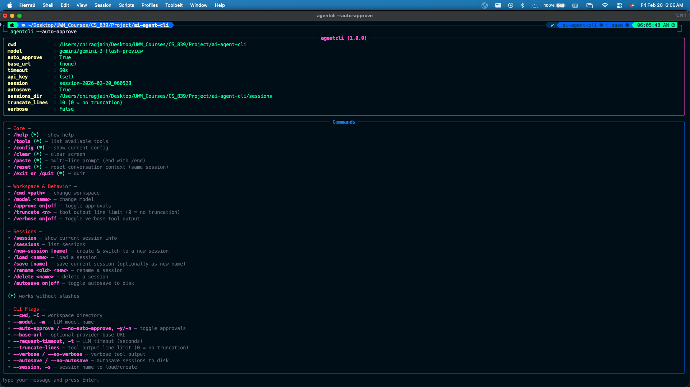
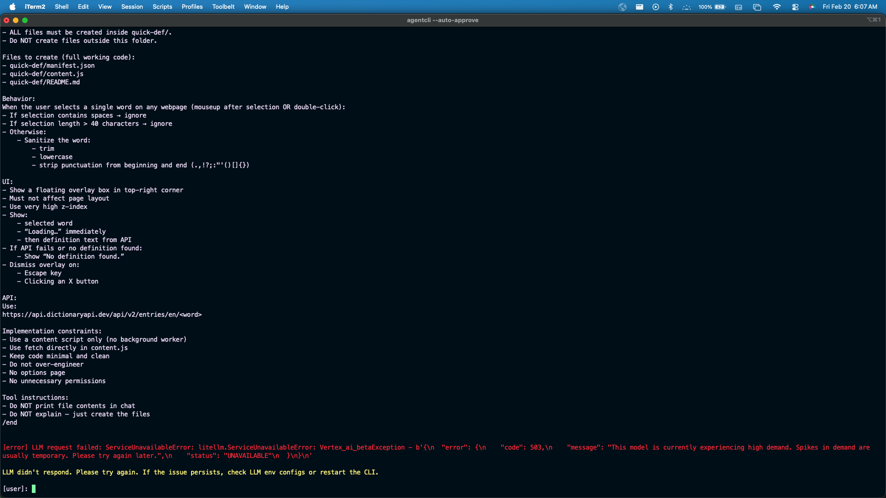
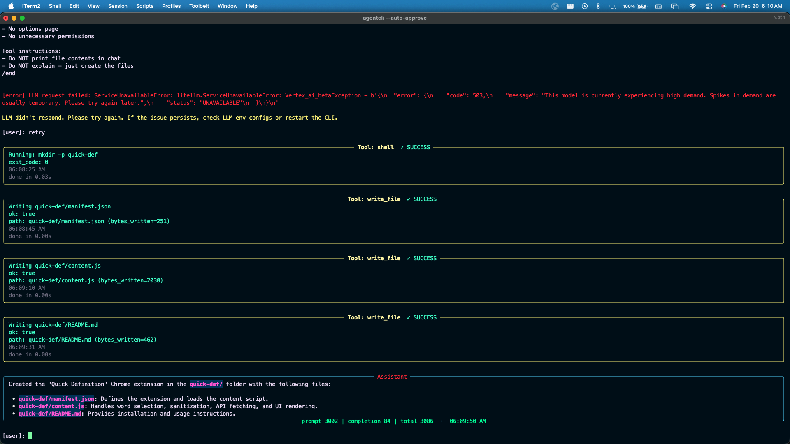
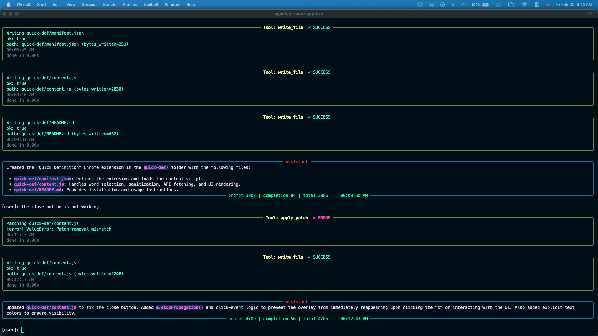
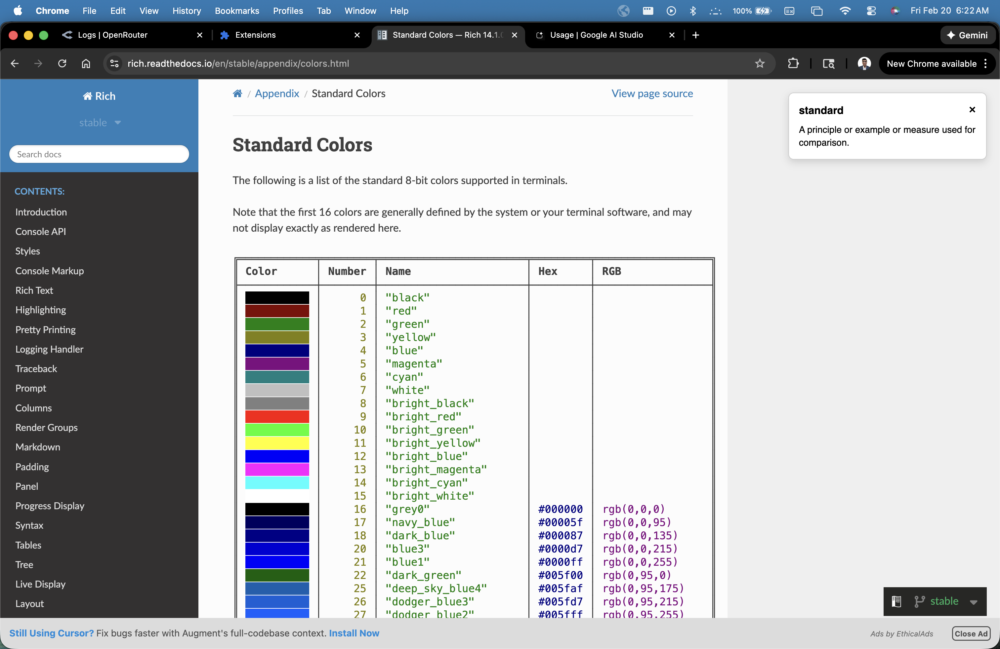

# agentcli — A Minimal CLI Coding Agent

## Quick Links

- [Installation](#installation)
- [Configuration](#configuration)
- [Running the CLI](#running-the-cli)
- [Interesting Project (Chrome Extension - Quick Def)](#interesting-project)

---
`agentcli` is a lightweight, polished, **command-line coding agent** (in the style of Claude Code / Cursor CLI). It.
- Accepts prompts in a terminal REPL
- Calls an LLM via **LiteLLM** (streaming)
- Parses **tool/function calls**
- Executes local tools (filesystem + shell + search + web)
- Shows **clear, professional UI** (Rich panels, spinners, token usage)
- Supports **sessions** (save/load/new/rename/delete) stored deterministically under `./sessions/` at the **project root**

> **Framework rule:** No agentic frameworks (LangChain/CrewAI/etc.). This uses raw LLM calls (via LiteLLM) + explicit tool execution.

---
## Disclosure/References  

- A lot of this code was generated using ChatGPT 5.2 (including this README).
- I also referenced the following repository
  - https://github.com/RivaanRanawat/ai-coding-agent/tree/main
- My first version of the agent-cli was this
  - https://github.com/QUASARS06/ai-coding-agent
  - I faced a lot of issues and hence decided to take my learnings from the first iteration and create this `agentcli`.


Apart from the above I went over multiple documentations like LiteLLM, Typer/Rich for CLI, Gemini API, Open-Router, etc

---

## Features

### Core Agent
- Interactive REPL: type and press Enter
- Streaming LLM output
- Tool calling loop (LLM => tool => LLM ...) with safety caps
- Optional approvals for write/shell operations
- Token usage displayed after responses (prompt/completion/total)

### Polished CLI UX
- Startup banner shows current configuration (like `/config`)
- Commands panel with clear help + visual cues
- Spinner while waiting for LLM (stops on first token)
- Tool panels show action, status, timestamps, and timings

### Tools
Built-in tools (typical set; see **Tools** section below):
- Filesystem: `list_dir`, `walk_dir`, `read_file`, `write_file`, `delete_file`, `apply_patch`
- Shell: `shell`
- Local search: `search_text`
- Web: `web_search`, `web_fetch`

### Sessions
- Deterministic storage: `./sessions/` in the repo root (not `cwd`)
- Auto-load last used session on startup
- Create/load/save/delete/rename sessions
- Autosave toggle (on/off)

### Output Controls
- **truncate** tool output (line limit; default **10**)
- **verbose** mode toggle (full vs compact tool output)

---

## Project Layout

Typical structure:

```
ai-agent-cli/
  agentcli/
    __init__.py
    __main__.py
    cli.py
    config.py
    llm.py
    prompts.py
    ui.py
    util.py
    sessions.py
    tools/
      __init__.py
      base.py
      registry.py
      fs.py
      shell.py
      web.py
  pyproject.toml
  .env.example
  README.md
  sessions/              # created at runtime
```

---

## Installation

### 1) Create and activate a virtual environment

**macOS / Linux**
```bash
python -m venv .venv
source .venv/bin/activate
```

**Windows (PowerShell)**
```powershell
python -m venv .venv
.venv\Scripts\Activate.ps1
```

### 2) Install in editable mode
From the repo root (where `pyproject.toml` is):

```bash
pip install -e .
```
### 3) Create your `.env`
Copy the example and edit:

```bash
cp .env.example .env
```

Update the `LLM_API_KEY` and `LLM_MODEL` in the .env 

---

## Configuration

This project uses **generic env var names** to keep providers interchangeable. You may add the following in `.env`

### Required
- `LLM_API_KEY` — your provider key (OpenRouter, Gemini, OpenAI-compatible, etc.)

### Common
- `LLM_MODEL` — model string (examples below)
- `LLM_BASE_URL` — optional API base for OpenAI-compatible providers
- `LLM_TIMEOUT` — request timeout seconds

### Optional UX defaults
- `TRUNCATE_LINES` — default tool output line truncation (default `10`)
- `VERBOSE` — `1` to start verbose, else compact
- `AUTOSAVE` — `1` to autosave sessions (default on)
- `AUTO_APPROVE` — `1` to auto-approve writes/shell by default

#### Example provider setups

**OpenRouter
```env
LLM_API_KEY=...
LLM_MODEL=openrouter/arcee-ai/trinity-large-preview:free
# LLM_BASE_URL not required (LiteLLM handles OpenRouter model prefix)
```

**Gemini (AI Studio / Developer API)**
```env
LLM_API_KEY=...
LLM_MODEL=gemini/gemini-3-flash-preview
# LLM_BASE_URL usually not needed
```

**OpenAI-compatible provider**
```env
LLM_API_KEY=...
LLM_MODEL=openai/gpt-4o-mini
LLM_BASE_URL=https://api.your-provider.com/v1
```

---

## Running the CLI

### Recommended
After `pip install -e .`, run:

```bash
agentcli
```

Or:

```bash
python -m agentcli
```

On startup you’ll see:
- an `agentcli (<version>)` config panel
- a Commands panel
- and a prompt line: `Type your message and press Enter.`

---

## CLI Flags

All core settings can be passed from the command line (and override `.env` defaults):

| Flag | Description |
|---|---|
| `--cwd`, `-C` | Workspace directory for file operations. **Strictly validated** (must exist and be a directory). |
| `--model`, `-m` | LLM model name (`openrouter/...`, `gemini/...`, `openai/...`, etc.). |
| `--auto-approve / --no-auto-approve`, `-y/-n` | Auto-approve file writes and shell commands. |
| `--base-url` | Optional base URL for OpenAI-compatible APIs. |
| `--request-timeout`, `-t` | LLM request timeout seconds. |
| `--truncate-lines` | Default tool output truncation line count (`0` = no truncation). |
| `--verbose / --no-verbose` | Start in verbose mode (prints more tool output). |
| `--autosave / --no-autosave` | Start with autosave enabled/disabled for sessions. |
| `--session`, `-s` | Session name to load/create on startup. |

### Examples
```bash
# Use current directory as workspace, pick a model
agentcli --cwd . --model openrouter/arcee-ai/trinity-large-preview:free

# Gemini model, autosave off
agentcli --model gemini/gemini-1.5-pro --no-autosave

# Force verbose + no truncation
agentcli --verbose --truncate-lines 0
```

---

## Commands (REPL)

### Command prefix rules
- Some commands work **with or without** a leading `/` or `\` (e.g., `help`, `quit`).
- **Session-impacting commands** (like `delete`) are **slash-only** to prevent accidental triggering in natural language.

In the Commands panel, commands that work without slashes may be marked with `(*)`.

---

## Command Reference

### Core Commands

| Command | Description |
|---|---|
| `/help` | Show startup banner + commands list. |
| `/tools` | Show available tools. |
| `/config` | Show current config (workspace/model/session/autosave/etc.). |
| `/clear` | Clear terminal and re-print banner. |
| `/paste` | Paste multi-line prompt; finish with `/end`. |
| `/reset` | Reset conversation context (fresh system prompt) in the **current session**. |
| `quit` or `/quit` | Exit the CLI. (`exit` also supported.) |

### Workspace & Behavior

| Command | Description |
|---|---|
| `/cwd <path>` | Change workspace directory for tool operations. Also refreshes the system prompt so tool boundaries match the new workspace. |
| `/model <name>` | Change model for future calls. |
| `/approve on\|off` | Toggle auto-approval. When off, destructive actions may require confirmation. |
| `/truncate <n>` | Set tool output truncation (lines). `0` means **no truncation**. |
| `/verbose on\|off` | Toggle verbose tool output. |

### Sessions (slash-only)
Sessions are stored in **repo-root** `./sessions/` regardless of `cwd`.

| Command | Description |
|---|---|
| `/session` | Show current session info. |
| `/sessions` | List sessions, highlighting current. |
| `/new-session [name]` | Create and switch to a new session (auto-name if none). |
| `/load <name>` | Load an existing session. Errors if session doesn't exist. |
| `/save [name]` | Save current session. If name provided, save as new session; errors if name already exists. |
| `/rename <old> <new>` | Rename a session. |
| `/delete <name>` | Delete a session. Errors if session doesn’t exist. If deleting current session, creates and switches to a new session. |
| `/autosave on\|off` | Toggle autosave. If turned on, immediately saves current session. |

---

## How sessions work (important)

`agentcli` supports **named sessions** so you can maintain multiple independent conversations (each with its own message history + context). Sessions are saved as JSON files on disk.

### Where sessions are stored
Sessions are stored **deterministically** in:

- `./sessions/` at the **project root** (the directory that contains your `pyproject.toml`, `.venv`, `README.md`, etc.)

This is intentional:
- Your `--cwd` (workspace for tools) can change per run.
- Sessions should still be in one consistent place regardless of workspace.

### Auto-loading behavior on startup
When you start `agentcli`:

1. If you pass `--session <name>`:
   - If the session exists → it loads it
   - If it does not exist → it creates it and starts fresh

2. If you do **not** pass `--session`:
   - It automatically loads the **last used session**
   - If there are no sessions on disk yet (first run) → it creates a new session automatically

### Autosave behavior
Sessions can be saved in two ways:

#### Autosave = ON (default)
If `autosave` is enabled:
- After each successful agent turn (LLM + tools), the current session is written to disk.
- Running `/reset` also saves the cleared/fresh state immediately (so your session file reflects the reset).

You can toggle autosave in the REPL:
```text
[user]: /autosave off
[user]: /autosave on
```

You can also toggle it on startup:
```bash
agentcli --no-autosave
agentcli --autosave
```

#### Autosave = OFF
If autosave is disabled:
- The CLI **does not write** session changes automatically.
- Your current session may still load from disk at startup, but future changes won’t be persisted unless you manually `/save`.

---

## Session commands in detail

### `/session`
Shows current session metadata:
- session name
- autosave status
- sessions directory path
- file path on disk

Useful to confirm “where am I saving?”

---

### `/sessions`
Lists all sessions found in `./sessions/`.

It highlights the current session (typically with a star or marker).

---

### `/new-session [name]`
Creates a **brand new session** and switches to it immediately.

- If a name is provided: uses that name
- If no name is provided: generates a unique name automatically (e.g., `session-20260220-042800`)

It starts with a fresh system prompt and empty conversation context.

Example:
```text
[user]: /new-session
[user]: /new-session chrome-ext-work
```

---

### `/load <name>`
Loads an existing session by name.

- If the session does not exist → prints a clean red error and does nothing.
- After loading, the system prompt is refreshed (so it reflects your current `cwd` and current run config).

Example:
```text
[user]: /load chrome-ext-work
```

---

### `/save [name]`
Writes the **current** conversation to disk.

Two modes:

#### 1) Save current session name
```text
[user]: /save
```

#### 2) Save as a new session name
```text
[user]: /save my-new-session
```

Rules:
- If the target name already exists → error (prevents accidental overwrite).
- If you provide a new name, the CLI switches the active session name to that new name.

---

### `/rename <old> <new>`
Renames a session file on disk.

Rules:
- If `old` does not exist → error
- If `new` already exists → error
- If you rename the currently active session → the CLI updates the active session name automatically

Example:
```text
[user]: /rename chrome-ext-work chrome-extension-v3
```

---

### `/delete <name>`
Deletes a session from disk.

Rules:
- If the session does not exist → error
- If you delete the current active session:
  - The CLI creates a fresh new session automatically and switches you to it
  - This ensures you’re never left without an active session

Example:
```text
[user]: /delete chrome-extension-v3
```

---

## `/reset` and sessions
`/reset` clears the **conversation context** but does not remove the session itself.

What it does:
- Replaces message history with a fresh system prompt
- Keeps session name and settings (autosave, truncate, etc.) unchanged

If autosave is ON, the cleared history is saved immediately.

---

## Slash-only safety rule for session commands
Commands like `delete`, `load`, `save`, `rename`, etc. are **slash-only** to prevent accidents.

For example:
- `delete ice.txt` (without `/`) should be treated as normal user text, not a session command.
- `/delete ice` is explicitly a session delete command.

This protects you from deleting sessions by accident while chatting normally.

---

## How `truncate` and `verbose` work (important)

These settings affect how **tool outputs** are shown to the user.

### `truncate_lines` (default: 10)
Tool outputs can be large (directory trees, web fetch text, etc.). Truncation helps keep the UI readable.

- If `truncate_lines = 10`, a tool output will show at most 10 lines.
- If `truncate_lines = 0`, tool output is **not truncated**.

Change it at runtime:
```text
[user]: /truncate 25
```

### `verbose`
Verbose controls whether tools print **extra details** (depending on tool implementation and UI).

- Verbose **ON**: show more detailed tool output
- Verbose **OFF**: prefer compact summaries

Toggle it at runtime:
```text
[user]: /verbose on
```

> Tip: If you want compact output but still need full results occasionally, temporarily set `/truncate 0` and then switch back.

---

## Tools

This agent exposes a set of tools to the LLM via function calling.

### Filesystem tools
- `list_dir(path)` — list a directory
- `walk_dir(path, max_depth=...)` — recursive tree listing
- `read_file(path)` — read file contents
- `write_file(path, content)` — write/overwrite file
- `delete_file(path)` — delete a file
- `apply_patch(path, patch)` — apply a unified-diff-style patch

### Shell tool
- `shell(command, cwd=...)` — runs a shell command **inside the workspace**

### Local search
- `search_text(query, path=..., glob=..., max_results=...)` — search occurrences in workspace

### Web tools
- `web_search(query, max_results=...)` — search the web (provider depends on your tool implementation)
- `web_fetch(url)` — fetch page text for summarization/extraction

> Web tool behavior depends on the implementation in `agentcli/tools/web.py`. Some sites block scraping (403). Prefer official docs.

---

## Safety and Approvals

When `auto_approve` is **OFF**, tools that modify state may require confirmation:
- `write_file`
- `delete_file`
- `apply_patch`
- `shell` (depending on implementation)

If a user rejects an action, the tool result is handled as a **polished “Operation rejected”** message, and the agent should **not** retry automatically.

---

## Interesting Project

### Chrome Extension: Quick Def
I asked the agent `agentcli` to create a Chrome Extension which shows the meaning of the selected word on an overlay. This was the exact prompt I gave in `/paste` mode.
```
Create a minimal Chrome Extension (Manifest V3) called "Quick Definition".

IMPORTANT:
- Create a folder named quick-def in the current workspace.
- ALL files must be created inside quick-def/.
- Do NOT create files outside this folder.

Files to create (full working code):
- quick-def/manifest.json
- quick-def/content.js
- quick-def/README.md

Behavior:
When the user selects a single word on any webpage (mouseup after selection OR double-click):
- If selection contains spaces → ignore
- If selection length > 40 characters → ignore
- Otherwise:
    - Sanitize the word:
        - trim
        - lowercase
        - strip punctuation from beginning and end (.,!?;:"'()[]{})

UI:
- Show a floating overlay box in top-right corner
- Must not affect page layout
- Use very high z-index
- Show:
    - selected word
    - “Loading…” immediately
    - then definition text from API
- If API fails or no definition found:
    - Show “No definition found.”
- Dismiss overlay on:
    - Escape key
    - Clicking an X button

API:
Use:
https://api.dictionaryapi.dev/api/v2/entries/en/<word>

Implementation constraints:
- Use a content script only (no background worker)
- Use fetch directly in content.js
- Keep code minimal and clean
- Do not over-engineer
- No options page
- No unnecessary permissions

Tool instructions:
- Do NOT print file contents in chat
- Do NOT explain — just create the files
/end
```

### 1. I started the agentcli in auto-approve mode



### 2. The prompt failed on first try because Gemini was experiencing high load



###  3. So I simply typed `"retry"` and it worked this time (though the API response times were high and it took a while for the request to complete)



### 4. I loaded the extension on Chrome and it worked as expected but the close button was not working. So I gave the following prompt - `"the close button is not working"`. And it fixed the issue.



### 5. Finally I tested the extension and it worked exactly how I wanted it to work. (see top right corner in below image)



- The code generated by the agent is present in `./quick-def/`
- I used /paste to give the prompt since Mac has a default limit on the canonical input limited to 4096 characters